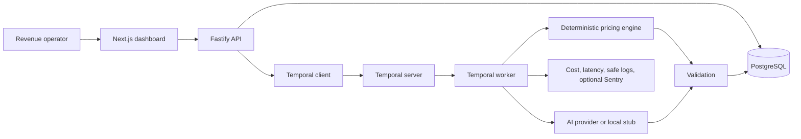
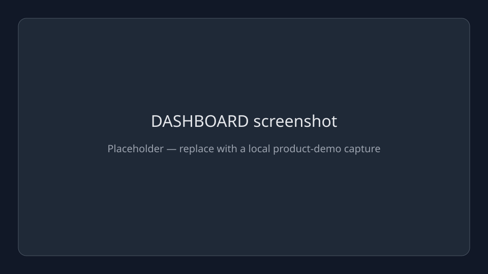
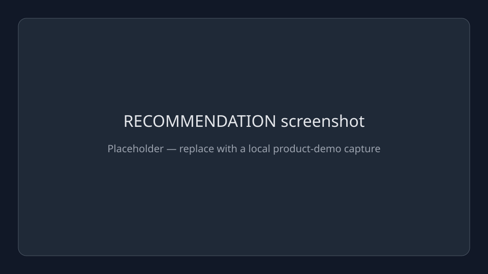
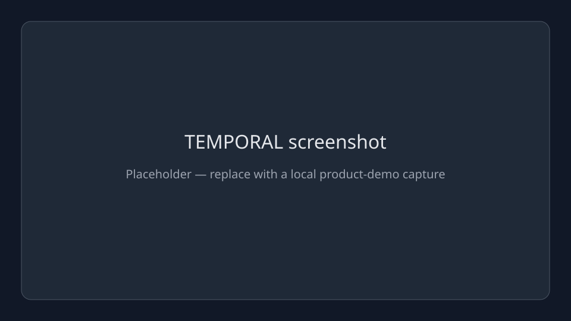
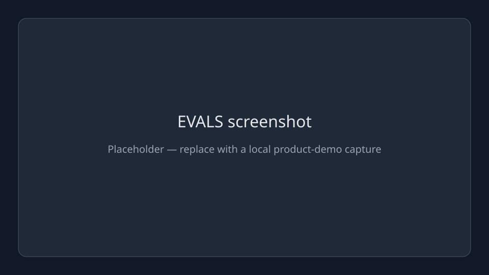

# RentalRateHelper

RentalRateHelper is a working local demo of a reliable dynamic-pricing workflow for short-term rentals. It uses fake rental-market data to generate durable nightly-price recommendations, then presents the result in a small operations dashboard.

The short-term-rental vertical is deliberately narrow. The architecture establishes the foundations needed before connecting real customer data: deterministic pricing rules, validated AI context, Temporal workflows, idempotency, evaluation, cost and latency tracking, and safe observability.

> The deterministic engine owns every pricing decision. AI may add human-readable explanation, confidence, and risk metadata only after that metadata passes validation.

## What the product demonstrates

- A deterministic price and safe range based on property and market signals.
- A durable Temporal workflow with retry behavior and a property/date idempotency key.
- Structured AI metadata that cannot change the authoritative price.
- Validation of output shape, explanation, confidence, risk level, property bounds, deterministic range, and the 30% maximum price-increase policy.
- PostgreSQL persistence for workflow state, recommendations, and AI-call metrics.
- Dashboard visibility into activity, accepted recommendations, failures, validation rejections, latency, and estimated AI cost.
- Safe structured logs and optional Sentry reporting that exclude prompts, raw provider responses, credentials, and database URLs.

## Architecture



See [Architecture](docs/ARCHITECTURE.md) for the component and data-flow details.

## Product demo

### Prerequisites

- Node.js 20 or later
- pnpm 10.15.0 (`corepack enable` can install the declared version)
- Docker and Docker Compose

### Start locally

```bash
pnpm install
cp .env.example .env
pnpm infra:up
pnpm --filter database db:migrate
pnpm --filter database db:seed
pnpm dev
```

The default `AI_PROVIDER=stub` is deterministic, needs no API key, and makes no network AI request. It is the recommended demo mode.

Open:

- Dashboard: <http://localhost:3000>
- API health: <http://localhost:8080/health>
- Temporal UI: <http://localhost:8233>

### A five-minute operator walkthrough

1. Open **Dashboard** to see system activity and safe operational metrics.
2. Open **Properties**, select a seeded property and a new pricing date, then choose **Generate recommendation**.
3. Watch the status become accepted and open **Recommendations** to see the deterministic price, safe range, validated explanation, confidence, risk, and AI metrics.
4. Search the workflow ID in **Temporal UI** to see the durable workflow execution.
5. Open **Evals** and run `pnpm --filter api eval:pricing` in a terminal to show deliberate expected-versus-actual pricing checks.

Repeating the same property/date reuses the same logical workflow or completed result. This is intentional idempotency, not a duplicate recommendation.

## Screenshots

These are placeholders for the final local-product screenshots. Replace the files in `docs/images/` after capturing the demo; no generated or stock screenshots are used.

| Operator story | Placeholder |
| --- | --- |
| System health and recent activity |  |
| Select a property and pricing date |  |
| Review an accepted recommendation |  |
| Verify durable workflow execution |  |
| Review deliberate evaluation results |  |

## Verification

Run the release checks from the repository root:

```bash
pnpm --filter shared test
pnpm --filter pricing test
pnpm --filter api test
pnpm --filter worker test
pnpm --filter api eval:pricing
pnpm --filter worker test:temporal-retry
pnpm typecheck
pnpm build
git diff --check
```

The Temporal integration suite requires the Docker services, database migrations, and seed data:

```bash
pnpm infra:up
pnpm --filter database db:migrate
pnpm --filter database db:seed
pnpm --filter worker test:temporal-retry
```

## Documentation

- [Architecture](docs/ARCHITECTURE.md) — system design, workflow, data boundaries, and extension path.
- [Evaluation methodology](docs/EVALS.md) — deterministic ground truth and safe handling of failures.
- [Security boundaries](docs/SECURITY.md) — secrets, logging, AI-output validation, and fake-data scope.
- [Incident runbook](docs/INCIDENT_RUNBOOK.md) — response procedures for dependency and quality failures.
- [Cost model](docs/COST_ANALYSIS.md) — token estimates, model tradeoffs, and cost controls.

## Local configuration

The tracked [.env.example](.env.example) uses safe local defaults. Keep real keys only in the ignored root `.env`.

```dotenv
AI_PROVIDER=stub
OPENAI_API_KEY=
OPENAI_MODEL=
SENTRY_DSN=
```

Set `AI_PROVIDER=openai` and `OPENAI_API_KEY` only for a manual OpenAI smoke check. Set `SENTRY_DSN` only when you want optional error telemetry. Neither is required for the local demo or automated checks.

## Current MVP boundaries

The current product intentionally uses fake, USD-only rental data and excludes authentication, billing, live Airbnb or market-data integrations, web scraping, multi-tenancy, and deployment automation. Those are product decisions, not missing prerequisites for the local workflow.

The existing architecture can later support additional pricing verticals—such as hotels, ecommerce, food delivery, or import/export—by introducing a vertical-specific input adapter and deterministic pricing policy while retaining the workflow, validation, metrics, and observability boundaries.

## Useful commands

```bash
pnpm infra:up                 # start PostgreSQL and Temporal containers
pnpm dev                      # start web, API, and worker
pnpm temporal:smoke           # run the small Temporal connectivity smoke test
pnpm infra:down               # stop containers while preserving data volumes
```

Do not use `docker compose down -v` for normal development: it removes the PostgreSQL volume.
