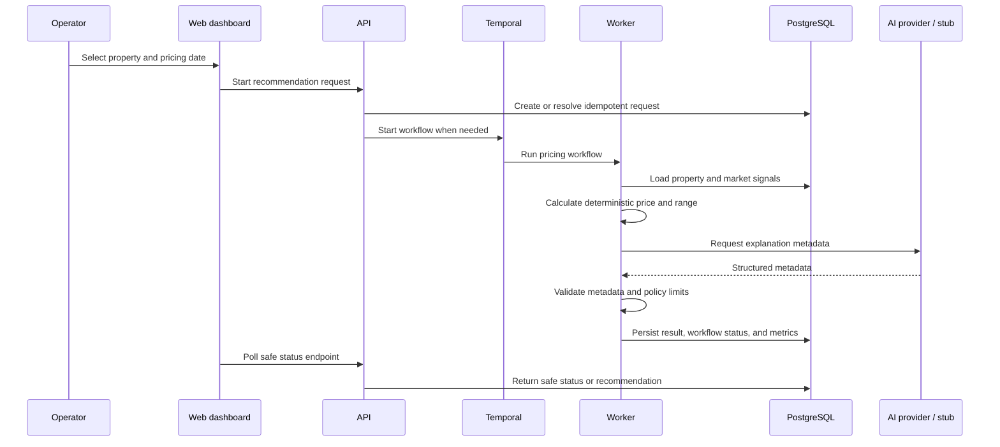

# Architecture

RentalRateHelper is structured as a small, durable pricing system rather than a synchronous AI endpoint. The short-term-rental implementation is the first pricing vertical.

## System design

The operator-facing stack is Next.js dashboard → Fastify API → PostgreSQL and Temporal. The worker owns the workflow activities. PostgreSQL holds rental data, durable request state, accepted recommendations, and AI-call metrics; Temporal coordinates execution and retries.

## Pricing and validation boundary

The deterministic engine calculates the authoritative recommended price and a safe range from property information and fake market signals. It caps a single price increase at 30%, matching the hard validation policy. If a property minimum is above that 30% cap, the worker records a non-retryable `INVALID_PRICING_CONFIGURATION` failure before calling AI; it never creates a price that violates either constraint.

AI receives the already-authoritative result and returns structured explanation, confidence, risk, and an echoed `recommended_price`. Validation requires the echoed price to exactly match the deterministic authoritative price, then checks the structured schema, non-empty explanation, confidence range, supported risk level, property bounds, safe range, and the 30% policy. Invalid metadata becomes a rejected workflow result; it never changes the deterministic price.

## Reliability behavior

- The workflow ID is deterministic per `property_id + pricing_date`.
- Duplicate starts resolve the existing request rather than creating another recommendation.
- Temporary provider and persistence failures retry through Temporal.
- Terminal workflow failures persist a safe category, not a raw error.
- Failed provider attempts record metrics without a recommendation.
- Validation rejections are expected safety outcomes and are distinct from workflow failures.

## Provider abstraction

`AI_PROVIDER=stub` returns deterministic metadata for local development and tests. `AI_PROVIDER=openai` uses the configured OpenAI model and structured output. Both providers return the same shared contract, so the workflow and validation layers do not depend on provider-specific payloads.

## Extension path

A future vertical should add a dedicated input/data adapter, pricing-policy implementation, seed or integration source, and eval cases. It should preserve the shared workflow lifecycle, idempotency, output validation, metrics schema, dashboard patterns, and safe observability practices.
